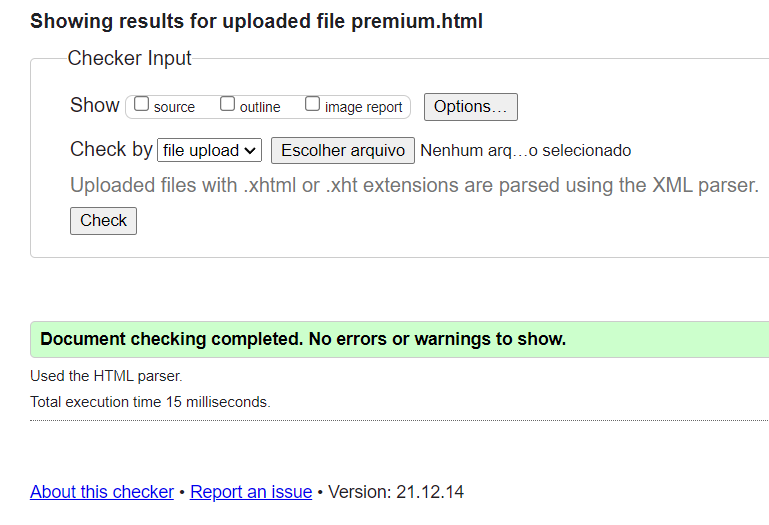

# NFT AGENDA

This comprehensive site was designed for an agenda(NFT agenda). The focus of the site is to provide information about NFT release dates, whitelists and a selection of the most famous games.

This is the first of four Milestone Projects that the developer must complete during the Full Stack Web Development Program at The Code Institute.

The main requirements were to make a responsive and static website with a minimum of three pages or at least 3 separate page area using primarily HTML5 and CSS3.

## UX

The purpose is to design an attractive website to NFT investors, with a simple and intuitive layout that works on mobiles, tablets or desktops.

## User Stories
### First Time Visitor Goals
1. As a first time visitor, I want to easily see the calendar,whitelists and dates I am looking for.
2. As a first time visitor, I want to find information about new projects.
3. As a first time visitor, I want to find out what is the best NFT project.

### Returning Visitor Goals
1. As a Returning Visitor, I want to check the new projects on the whitelist section.
2. As a Returning Visitor, I want to know what is the new game of the week.
3. As a Returning Visitor, I want to be able to access your social media accounts.

### Frequent User Goals
1. As a Frequent User, I want to use the calendar daily.
2. As a Frequent User, I want to become a premium member.

## Design
### Colour Scheme

- The main colours used are dark grey, white, black and blue, to give the site a clean, modern and professional look.

### Typography

- The Montserrat font is used throughout the website with Sans Serif.

### Wireframes

#### index.html
1. [Desktop index.html](wireframe/desktopindex.png)

2. [Mobile index.html](wireframe/mobileindex.png)

3. [Tablet index.html](wireframe/tabletindex.png)

#### premium.html
1. [Desktop premium.html](wireframe/desktoppremium.png)

2. [Tablet premium.html](wireframe/tabletpremium.png)

3. [Mobile premium.html](wireframe/mobilepremium.png)

## Existing Features

### Navigation Bar

The navigation bar contains links to the Calendar, Upcoming Projects, Whitelists, Weekly Awards and Premium, identical in each page for an easy navigation.
This section will allow the user to have an easier navigation from page to page across all devices without having to revert back to the previous page via the ‘back’ button.

### Footer

The footer provides the user three sections, newsletter, links to the social media accounts (Youtube, discord, telegram, Facebook and Twitter) and Disclaimer.

### Home Page
- Logo

- Sections

The home page is composed of five sections,logo, calendar, upcoming projects with a carousel, whitelists, weekly awards and premium.

### Premium Page

The Premium page is divided in two rows, one explaining why the visitor should make a donation. The second row is the form to submit the donation details and a section with QR Codes to make the payment with explaination about which coins are accepted.

## Frameworks, Languages & Programs Used

### [VSCode](https://code.visualstudio.com/)
- This developer used VSCode for their IDE while building the website.

### [BootstrapCDN](https://www.bootstrapcdn.com/)
- The project uses Bootstrap v 5.1.0 to simplify the structure of the website.
- The project also uses BootstrapCDN to provide icons from FontAwesome.

### [Google Fonts](https://fonts.google.com/)
- The project uses Google fonts to style the website fonts.

### [Balsamiq](https://balsamiq.com/) 
- The project uses Balsamiq to create the wireframe mockups.

### HTML 5 
- Markup language designed to be displayed in a web browser.

### CSS 3
- Style sheet language used for describing the presentation of a document in HTML.

## Testing

### Development Testing

-  The Google Chrome Developer tools during the development of the website to inspect the site at different device sizes and in responsive mode.

### Manual Testing

- Navigation Bar

1. When the Premium name is clicked, it returns the user to the index.html.
2. When each link on the navbar is clicked, it takes the user to the correct page.

- Social Media Links
1. When each link is clicked, it opens a new tab.
2. When each link is clicked, it takes the user to the correct page.

- Forms
1. When submitted the form link to the correct place.

- Newsletter
2. When submitted the form link to the correct place.

### Code Validation

The W3C Markup Validator and W3C CSS Validator Services were used to validate the project to ensure there were no syntax errors in the project.

- W3C Markup Validator

index.html

premium.html 

- W3C CSS Validator 

- PowerMapper 

PowerMapper was used to double-check the browser compatibility.
## Testing User Stories from User Experience (UX) Section
### First Time Visitor Goals
1. As a first time visitor, I want to easily see the calendar,whitelists and dates I am looking for.
    - At the nav bar on top of the site contains a link to the sections.
    - On the calendar visitor can see all the projects organized by date and have more information clicking on each date.
    - At whitelists sections it's possible to join open whitelists by clicking on Participate.
  
2. As a first time visitor, I want to find information about new projects.
   - At Upcoming Projects, utilizing a Carousel visitor has access to new projects with a hyperlink.

3.  As a first time visitor, I want to find out what is the best NFT project.
    - At the Weekly Awards section the visitor can check the "editor's choice" of the week.

### Returning Visitor Goals
1. As a Returning Visitor, I want to check the new projects on the whitelist section.
    - Whitelists are updated by date, this way the visitor can check daily if there is a new whitelist to join.

2. As a Returning Visitor, I want to know what is the new game of the week.
    - Weekly Awards section it's intended to be update weekly, bringing back the visitor.

3. As a Returning Visitor, I want to be able to access your social media accounts.
    - The footer presents icons with links to the social medias.
    - Each link opens the social media in a new page.

4. As a Returning Visitor, I want to receive news on my e-mail.
    - By using a form on Newsletter section the visitor can subscribe his e-mail to receive personalized news.

    

### Frequent User Goals
1. As a Frequent User, I want to use the calendar daily.
    - The visitor can easily add the event to his own Google Calendar.

2. As a Frequent User, I want to become a premium member.
    - User can access the Premium page using the nav bar, hyperlink on Premium section, or an anchor on footer. Premium page contains details on how to become a premium member and a form to submit the donation information.   

  

### Issues
- The submit button on form wasn't working, was using an anchor tag together with button function.
- Navbar wasn't properly wrote, to improve accessibility added list function to the code.
- Whitelist section wasn't getting expected result, solved with a table function
- Paragraphs weren't aligning properly, fixed with css style line width: 50%;.

### Known Bugs

- On old devices, the images can break the layout.
- The carousel arrows doesn't stay near the image on big displays.
- The [Responsive design](http://ami.responsivedesign.is/#) website it's not showing the right responsive layout on cellphone, however the site it's working properly on mobile devices.
    1. [Incorrect](images/readmeimages/incorrect.png)
    2. [Correct](images/readmeimages/correct.png)

## Deployment

This project was developed using Visual Studio Code Insiders, committed to git and pushed to GitHub using git bash terminal.

### Deploying on GitHub pages

1. Log in to GitHub and navigate to the GitHub Repository.
2. At the top of the repository, select "Settings" from the menu items.
3. At the Settings menu, select "Pages".
4. Select the main branch and the page will be automatically refreshed with a detailed ribbon display to indicate the successful deployment.

The live link can be found here - https://blockjarvis.github.io/Codeinstitute/index.html

### Forking the GitHub Repository

By forking the GitHub Repository we make a copy of the original repository on our GitHub account to view and/or make changes without affecting the original repository by using the following steps.

1. Log in to GitHub and locate the GitHub Repository
2. At the top of the Repository (not top of page) just above the "Settings" Button on the menu, locate the "Fork" Button.
3. You should now have a copy of the original repository in your GitHub account.

### Making a Local Clone

1. Log in to GitHub and locate the GitHub Repository
2. Under the repository name, click "Clone or download".
3. To clone the repository using HTTPS, under "Clone with HTTPS", copy the link.
4. Open Git Bash
5. Change the current working directory to the location where you want the cloned directory to be made.
6. Type git clone, and then paste the URL you copied in Step 3.
7. Press Enter. Your local clone will be created.

## Credits

### Code

- Bootstrap v 5.1.0: Bootstrap was used through the project mainly the navbar and carousel.
- Google Calendar support: [This](https://support.google.com/calendar/answer/41207?hl=en) Google Calendar Help explained how to embed the calendar into the html code.
- FontAwesome: The icons in the footer were taken from Font Awesome.

### Media
1. images were sourced from:
   - [CryptoShips](https://cryptoships.club/home.html)
   - [CryptoBurguers](https://www.cryptoburgers.io/en/#)
   - [Evoverse](https://evoverse.app/)
   - [Bombcrypto](https://bombcrypto.io/)
  
2. All icons were sourced from [Flaticon](https://www.flaticon.com/).

3. Photoshop was used to make the logo and all the art, by a graphic designer (Rodrigo Lorenzo).

### Acknowledgements

- Student care and fellow students at Code Institute for their support.
- I would like to thank my friends, Diego Laterza, Danilo Liziero and Rodrigo Lorenzo for their help and guidance through the process.
